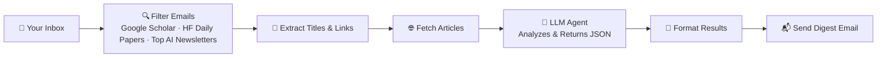
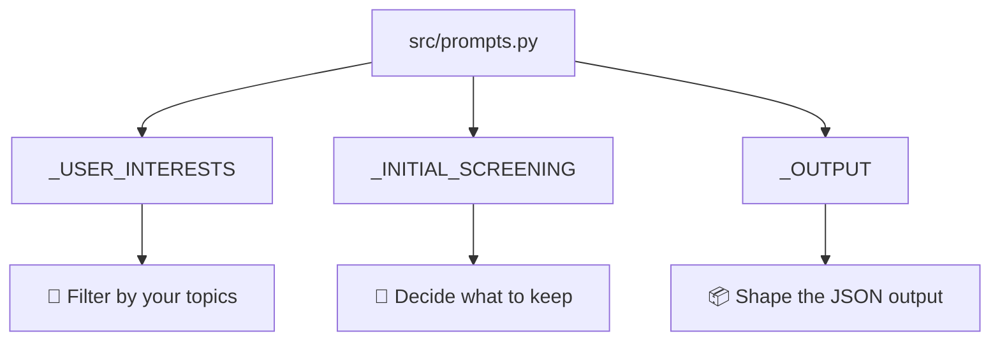

# Article Agent 🤖📚

**Article Agent** is an automated pipeline that reads your inbox, finds AI research papers (from Google Scholar, Hugging Face Daily Papers, and top AI newsletters), fetches the articles, summarizes them with an LLM, and emails you a nicely-formatted digest — all without you lifting a finger.

---

## ✨ What It Does

Here's the full flow at a glance:



In plain English:

1. **Scans your email** for messages coming from Google Scholar, Hugging Face Daily Papers, and top AI newsletter senders.
2. **Extracts** every article's title and URL.
3. **Fetches** the article content (with a timeout, so it never hangs).
4. **Passes** the content to an LLM agent, which returns a structured **JSON** response.
5. **Formats** the JSON and **emails** you a clean digest.

---

## 🧩 Requirements

- Python 3.10+
- An email account with an **app password** (Gmail recommended — see [Google's guide](https://support.google.com/accounts/answer/185833))
- One of: an API key for **Groq**, **Google**, **OpenRouter**, or a local **Ollama** install
- (Optional) A **proxy** if you need one for fetching articles

---

## ⚙️ Configuration

All configuration lives in the config file. Below is every option explained.

### 🌍 Global Configs

| Variable | Type | Default | Description |
| --- | --- | --- | --- |
| `DEVELOPMENT` | `bool` | `True` | Enables dev mode (extra logging, verbose errors). Set to `False` for production. |
| `USE_PROXY` | `bool` | `True` | Route outbound requests through a proxy. Set to `False` if you don't need one. |
| `PROXY_LINK` | `str` | `http://127.0.0.1:2080/` | The proxy URL used when `USE_PROXY=True`. |
| `PORT` | `int` | `8000` | Local port for the service/web UI. |

### 🧠 LLM Provider Names

| Variable | Example | Description |
| --- | --- | --- |
| `GROQ_LLM_NAME` | `"openai/gpt-oss-20b"` | Model ID used when calling **Groq**. |
| `GOOGLE_LLM_NAME` | `"Gemini 2.5 Pro"` | Model name used for **Google Gemini**. |
| `OPENROUTER_LLM_NAME` | `"nvidia/nemotron-3.5-lightning:free"` | Model ID for **OpenRouter**. |

### 🖥️ Local LLM (Ollama)

Use this if you want to run everything locally and avoid cloud APIs.

| Variable | Type | Default | Description |
| --- | --- | --- | --- |
| `USE_OLLAMA` | `bool` | `True` | If `True`, the agent will use a local Ollama server instead of cloud providers. |
| `OLLAMA_LLM_NAME` | `str` | `"qwen2.5:7b-instruct"` | Name of the Ollama model to load. `qwen3:8b` is also a great choice. |

### 🤖 Agent Behavior

| Variable | Type | Default | Description |
| --- | --- | --- | --- |
| `ARTICLE_COUNT_PER_MESSAGE` | `int` | `10` | Max articles summarized per digest email. |
| `FETCH_ARTICLE_TIMEOUT_SEC` | `int` | `5` | Timeout (seconds) for fetching each article URL. |
| `INCLUDE_PROQUEST` | `bool` | `False` | Include ProQuest-sourced papers in results. |
| `TOOL_CALLS_COUNT` | `int` | `5` | Max number of tool/LLM calls per article (limits cost & latency). |

### 📬 Email Configs

| Variable | Example | Description |
| --- | --- | --- |
| `EMAIL` | `"example@gmail.com"` | The address the agent reads **from** and sends **to**. |
| `EMAIL_PASSWORD` | `"xxxx xxxx xxxx xxxx"` | Gmail **app password** (not your regular password). |

### 🔑 API Keys

| Variable | Description |
| --- | --- |
| `GROQ_API_KEY` | API key for [Groq Cloud](https://console.groq.com/). |
| `OPENROUTER_API_KEY` | API key for [OpenRouter](https://openrouter.ai/). |
| `TAVILY_API_KEY` | API key for [Tavily](https://tavily.com/) — used for web search / article enrichment. |

#### 📄 Example config block

```python
# ── Global ──────────────────────────────────────────
DEVELOPMENT = True
USE_PROXY   = True
PROXY_LINK  = "http://127.0.0.1:2080/"
PORT        = 8000

# ── LLM Providers ───────────────────────────────────
GROQ_LLM_NAME       = "openai/gpt-oss-20b"
GOOGLE_LLM_NAME     = "Gemini 2.5 Pro"
OPENROUTER_LLM_NAME = "nvidia/nemotron-3.5-lightning:free"

# ── Ollama (local) ──────────────────────────────────
USE_OLLAMA       = True
OLLAMA_LLM_NAME  = "qwen2.5:7b-instruct"

# ── Agent ───────────────────────────────────────────
ARTICLE_COUNT_PER_MESSAGE  = 10
FETCH_ARTICLE_TIMEOUT_SEC  = 5
INCLUDE_PROQUEST           = False
TOOL_CALLS_COUNT           = 5

# ── Email ───────────────────────────────────────────
EMAIL          = "example@gmail.com"
EMAIL_PASSWORD = "your-app-password"

# ── API Keys ────────────────────────────────────────
GROQ_API_KEY       = "GROQ_API_KEY"
OPENROUTER_API_KEY = "OPENROUTER_API_KEY"
TAVILY_API_KEY     = "TAVILY_API_KEY"
```

---

## 🎨 Customizing the Agent

The agent currently filters for **my personal interests**. You can easily change what it cares about:

1. Open `src/prompts.py`.
2. Edit `_USER_INTERESTS` to reflect your own topics of interest.
3. Optionally tweak:
   - `_INITIAL_SCREENING` — how the agent decides which emails/articles are worth processing.
   - `_OUTPUT` — the JSON schema and tone of the final summary.



---

## 🚀 How to Use

> **Recommended setup:** Run a local LLM via **Ollama + `qwen3:8b`** on **Google Colab** (free GPU). It's the cheapest and fastest way to get started.

### 1. Install Ollama and pull a model

```bash
# On Colab or your local machine
curl -fsSL https://ollama.com/install.sh | sh
ollama pull qwen3:8b
```

### 2. Clone this repo

```bash
git clone https://github.com/<your-username>/article-agent.git
cd article-agent
```

### 3. Install dependencies

```bash
pip install -r requirements.txt
```

### 4. Set up your config

Fill in the config values as described in the [Configuration](#️-configuration) section above. Make sure `USE_OLLAMA = True` if you're using a local model.

### 5. Run the agent

```bash
python main.py
```

Sit back and wait for your first digest email. 📬

---

## 🛠️ Troubleshooting

| Problem | Likely Fix |
| --- | --- |
| No emails found | Check `EMAIL` / `EMAIL_PASSWORD` (must be an **app password**). |
| LLM call fails | Verify the API key for your chosen provider, or confirm Ollama is running (`ollama serve`). |
| Articles timing out | Increase `FETCH_ARTICLE_TIMEOUT_SEC`. |
| Proxy errors | Set `USE_PROXY = False` or correct `PROXY_LINK`. |

---

## 📄 License

Thit project is open source under MIT License.

---

## 🙌 Contributing

PRs and issues are welcome! If you customize the prompts for a specific niche (e.g., biology, robotics, NLP), feel free to share — it might help others.
